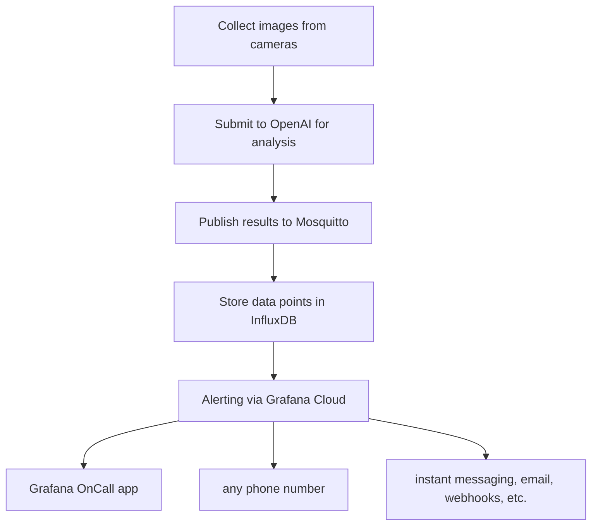

## README.md

# Emergency Detection System

## Features

- **Image Analysis**: Analyzes images to detect emergencies.
- **Emergency Classification**: Classifies emergencies into categories like fallen person, fire, medical emergency, etc.
- **Integration with MQTT**: Publishes emergency states to an MQTT broker.

## Integrations



* https://motion-project.github.io/ collects images from cameras
* this script, originally created just to display the images, has evolved to submit them to OpenAI for analysis 
* then publish the results to https://mosquitto.org/
* https://github.com/koo5/iot2/ stores the data points in InfluxDB
* https://grafana.com/products/cloud/ alerting is used to ping my phone when an emergency is detected.

### MQTT
https://github.com/emqx/blog/blob/main/en/202111/popular-online-public-mqtt-brokers.md

## Todo
* systemd unit template, for one unit for each camera.
* add a switch to disable the lame GUI and run headless

## Pricing
i have zero idea about local models. As on OpenAI... i've burned through $0.22 for my testing so far .. so i'm imagining, one might run let's say 5 cameras, but first there is `motion` where you configure what constitutes an event, and then you add some delays and sleeps .. so i'm thinking some hundreds of images per day, maybe going into a couple dollars a day, but i imagine things will get significantly cheaper over time?

## Requirements

- Python 3.x
- Pip
- Pygame
- OpenAI API
- Roboflow API
- Paho MQTT
- Fire

## Installation

1. Setup venv:
    ```sh
 virtualenv -p /usr/bin/python3.10 venv; . venv/bin/activate;
    ```

2. Install the required Python packages:
    ```sh
    pip install -r requirements.txt
    ```

3. Set up environment variables for API keys and MQTT:
    ```sh
    export OPENAI_API_KEY=your_openai_api_key
    export INFERENCE_API_KEY=your_roboflow_api_key
    export MQTT_HOST=your_mqtt_host
    export MQTT_PORT=your_mqtt_port
    export MQTT_USER=your_mqtt_username
    export MQTT_PASS=your_mqtt_password
    ```

## Usage

Run the main script with the desired options:
```sh
python main.py /path/to/images --lookback=50 --speak=True --CHATGPT=True
```

### Options

- `path`: Path to the directory containing images.
- `lookback`: Number of recent images to analyze.
- `speak`: Enable or disable speech notifications.
- `prompt`: Additional prompt for the AI model.
- `CHATGPT`: Enable or disable ChatGPT integration.
- `ROBOFLOW`: Enable or disable Roboflow integration.


## File Structure

- `main.py`: Main script to run the emergency detection system.
- `oai.py`: Contains functions for interacting with the OpenAI API.


## License

This project is licensed under AGPL-3.0.
